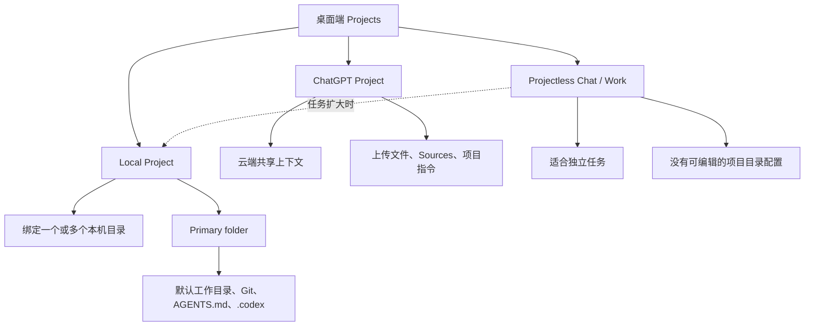

关键规则：

- 项目类型取决于其数据与目录模型，而不是由 ChatGPT 或 Codex 的名称决定。
- ChatGPT Project 保存云端上下文，不直接绑定本机目录。
- Local Project 可挂载多个本机文件夹，并用 Primary folder 决定默认工作目录。
- Chat 与 Work 可以存在于同一个项目中；对话模式不决定项目类型。
- Projectless 本地聊天没有项目级目录设置；当前公开文档未提供直接重绑定其工作区的方法。
- 需要稳定操作本机文件时，应建立 Local Project，并通过 `Edit project → Add folder → Make primary` 配置。
- Codex CLI 可用 `codex -C /path/to/workspace` 明确指定工作目录。
- `cd` 只改变命令进程的当前目录，不会扩大聊天的文件系统授权范围。