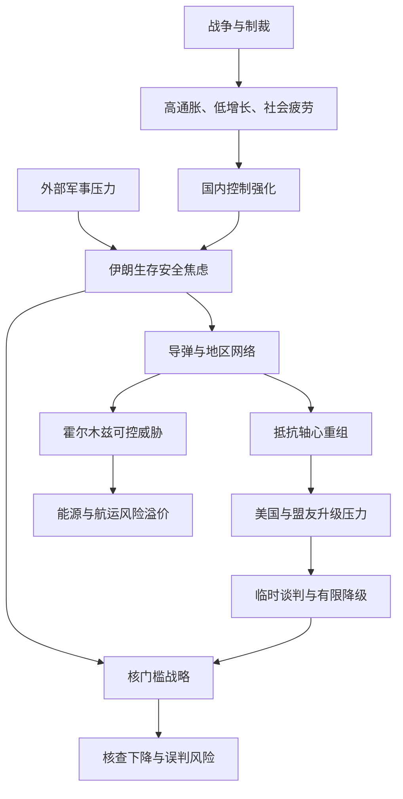

# 伊朗局势的战略结构压缩

## 核心拓扑

## 最小 faithful representation

1. 伊朗的目标不是单纯追求核武器，而是保留接近核门槛的能力，以换取威慑、谈判筹码和国内民族主义合法性；但核查中断会提高对手对“即将武器化”的判断，反而压缩外交窗口。
2. 霍尔木兹海峡是伊朗最现实的战略杠杆。伊朗更可能制造可控的航运风险，而非永久封锁；前者能抬高美国及全球经济成本，后者也会损害伊朗自身出口、财政和外交环境。
3. “抵抗轴心”不是完全受控的单一军事工具。真主党、胡塞及伊拉克民兵拥有自身目标，伊朗既需要地区纵深，又担心盟友行动造成失控升级。
4. 战争、制裁和通胀将民族主义凝聚力与社会疲劳同时推高。短期内政权突然崩溃可能性有限，但经济从“发展受限”进入“维持不崩溃”的韧性状态，国内安全控制可能进一步强化。
5. 美国及其盟友试图在不发动长期地面战争的情况下削弱伊朗核能力、导弹能力和地区网络；伊朗则试图把核门槛、海峡控制、导弹和代理人网络组合成安全保证与经济喘息。
6. 中国的主要利益是能源供应、航运安全和地区投资稳定，更可能支持停火、通航和核查恢复等外交安排，而非直接军事介入。

## 主要因果规则

- 核能力越接近武器化，伊朗的谈判筹码越大，但遭受预防性打击的风险也越高。
- 航运风险可以在不全面封锁海峡的情况下产生能源价格和保险溢价；长期封锁会反噬伊朗自身利益。
- 有限妥协、公开强硬、私下谈判，是伊朗在生存压力下的可行政策组合。
- 外部战争能短期提升民族主义，但不能抵消食品、住房、药品和货币贬值造成的长期政治成本。
- 低烈度冲突之所以危险，是因为各方都希望避免全面战争，却可能在报复链和误判中自动升级。

## 未来情景

| 情景 | 机制 | 结果 | 关注指标 |
|---|---|---|---|
| 阶段性降级 | 临时通航、有限核查、停火或制裁豁免 | 风险下降但根本矛盾保留 | 阿曼斡旋、通航稳定性、核查恢复 |
| 有限冲突长期化 | 海上拦截、代理人行动、网络攻击与定点打击持续 | 油价和航运长期含风险溢价 | 美国打击选项、代理人克制、基地与船舶遇袭 |
| 冲突失控 | 核设施或核心指挥系统遭打击，引发多线报复 | 海峡关闭、能源与地区安全冲击 | 海湾能源设施受袭、核活动武器化迹象 |

## 观察清单

- 霍尔木兹是否出现稳定、可验证的通航机制；
- 国际原子能机构能否恢复完整现场核查；
- 伊朗核材料库存和浓缩活动是否进一步失去可验证性；
- 美国或以色列是否扩大对核设施及指挥系统的打击；
- 美国基地、海湾能源设施和航运目标是否遭到直接攻击；
- 伊朗国内逮捕、死刑和抗议活动是否继续扩大。

## 开放问题

- 伊朗能否把“核门槛—海峡风险—地区网络”转化为可持续谈判筹码，而不触发联合军事打击？
- 海湾国家能否同时维持对美国的安全依赖与对伊朗的外交接触？
- 临时协议能否从危机降级机制发展为处理核查、制裁和安全保证的长期框架？

## 总判断

短期最可能是“有限降级与持续对抗并存”，而非彻底解决。伊朗具备人口、能源、工业基础和制裁适应能力，短期政权崩溃概率有限；但高通胀、低增长和高安全支出正在侵蚀其长期韧性。真正稳定必须同时处理伊朗的安全焦虑、美国对核扩散的担忧，以及海湾国家对能源和领土安全的需求。
