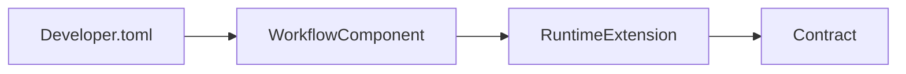
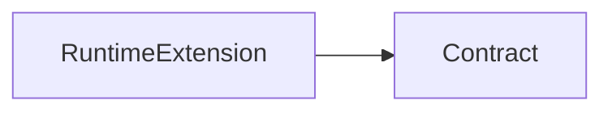
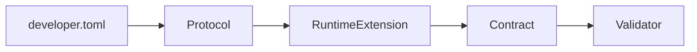
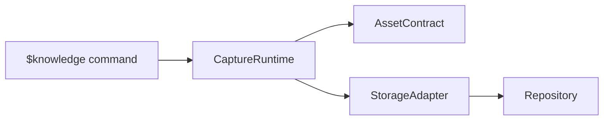

# Runtime Extension 设计原则

这里的 **Runtime Extension** 不是 OpenAI 官方固定术语，而是在设计 **Codex/Agent Runtime 架构时抽象出来的领域概念**。关系图是讨论中的架构压缩，不是官方文档。Codex 确实有 Plugin、Skill、App、MCP 等扩展机制，但这些属于平台能力，不等同于这里讨论的 Runtime Extension 领域模型。

讨论的核心不是“如何调用 Codex API”，而是：

> 如果设计一个 Agent Runtime 扩展层，应该如何避免把业务流程、协议、契约混在一起。

## 1. 不引入 Workflow Component

如果加入：

```text
Workflow Component
```

架构会变成：



Workflow 会开始承载：

- 流程控制
- 状态变化
- 业务逻辑
- 生命周期

最终 Runtime Extension 会退化成一个“大杂烩”。

判断是：

> Workflow 应该属于上层 Orchestration，而不是 Runtime Extension 的核心组成。

也就是说：

```text
Agent Workflow
        |
        v
Runtime Extension
        |
        v
Execution Contract
```

而不是：

```text
Runtime Extension
        |
        v
Workflow Engine
```

## 2. Contract 应该放在 Runtime Extension 中

Contract 是 Runtime 和外部交互的边界协议，例如：

- 输入结构
- 输出结构
- Validator
- Capability 描述
- Error handling

错误设计：

```text
Runtime
 |
 Workflow
 |
 Contract
```

正确设计：



原因是 Contract 描述：

> “这个 Runtime Extension 能提供什么能力，以及如何交互。”

而不是：

> “这个 Workflow 下一步应该做什么。”

## 3. developer.toml 负责引用 Protocol

问题是：为什么还需要额外写 Runtime `workflow.md`？

观点是：

> Workflow 已经属于配置层，为什么再复制一份 Markdown？

因此需要区分 TOML、Protocol 和 Runtime Extension 的职责。

### TOML

负责：

- 声明
- 引用
- 配置

例如：

```toml
[agent]
runtime_extension = "xxx"
protocol = "xxx"
```

它告诉 Runtime 使用哪个协议。

### Protocol

负责稳定接口定义：

```text
Protocol
 |
 +-- request schema
 +-- response schema
 +-- validation rules
```

### Runtime Extension

负责运行能力。

最终关系：



含义：

```text
developer.toml
        |
        | selects
        v
Protocol
        |
        | defines interface
        v
Runtime Extension
        |
        | exposes
        v
Contract
        |
        | verifies
        v
Validator
```

## 4. 与 Knowledge Skill 架构的共同思想

Knowledge Skill 采用了类似原则：不要让一个组件承担太多职责。

错误设计：

```text
Knowledge Skill
 |
 +-- 捕获
 +-- 分类
 +-- 整理
 +-- 生成 View
 +-- 同步 Git
 +-- NotebookLM 导出
```

正确设计：

```text
Knowledge Skill
        |
        v
Capture Runtime
        |
        +-- Asset Contract
        |
        +-- Storage Adapter
        |
        +-- View Generator
```

这和 Runtime Extension 的思想一致：

- Skill 不负责所有事情
- Runtime 不负责 Workflow
- Contract 定义边界
- Adapter 负责外部能力

## 总结

两套设计共享同一原则：

> 不要把流程、能力、数据契约、存储、展示混合。

Runtime 架构：


Knowledge Skill 架构：



背后的职责模型是：

> 上层决定意图，中层执行能力，Contract 固化边界，Adapter 隔离外部系统。
