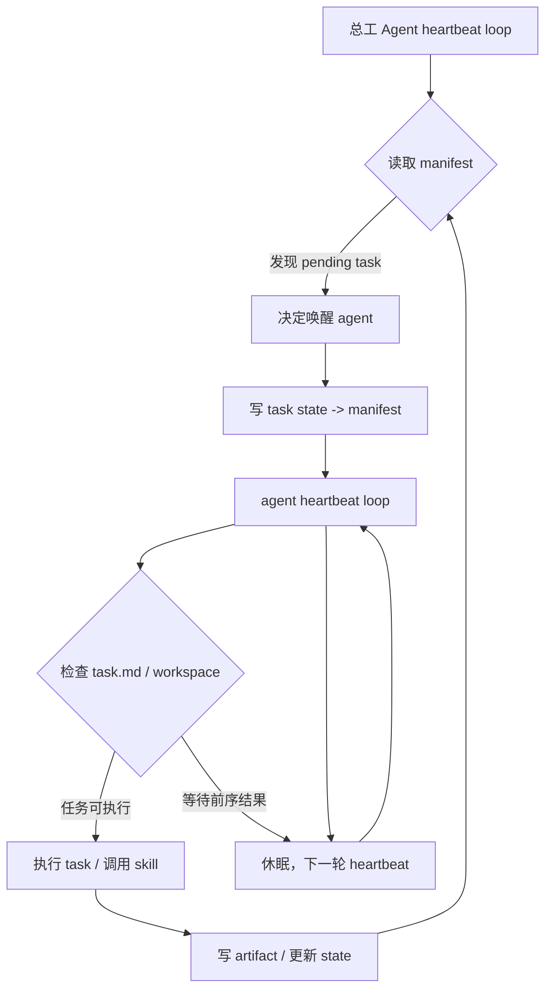

**总工 prompt**

```
作为一个总工程师，你接到任务后
一 定义项目类型，区分任务难易，规划工作区间。
区分一次性的简单任务还是简单的routine 任务。简单任务应当考虑解决一次性解决。
注意，是routine的类型，就应当考虑用Corn或者是lobster解决，方便我以后复用，
总之简单任务你只需要完成对单个agent注入和调用。
2 你认为在15分钟之内无法完成的复制任务，则应该构建一个agent团队来协作完成。
每个agent有独立的session和独立的agentid-workspace/
task.md放到其中
3 你配置的协作类agent要满足下面的要求:
每个agent有独立的session和独立的workspace。
每个agent在开始工作时要
1 熟悉合作规范
2 要熟悉自己的任务范围
3 退出时做出artifact总结
4 在退出时应当@总工。
5 你将为basic agent indentity.md注入prompt，并用run agent的模式Invoke agent。
唤醒模式可以按需采用并行或次序模式来进行Invoke agent。唤醒模式可以按需采用并行或次序模式来进行
5 如果你认为任务模块应当是次序进行的，那么你应当考虑每个模块之间数据流的约定交接格式，
和存放目录(一般格式以json或者csv，
目录为
share-doc/task-agent-1，share-doc/task-agent-2,hare-doc/task-agent-2

6 任务规划后拆分，成模块化
你把它拆成n个子任务模块文件，每一个文件放到agent对应的 agentid-workspace。
你需要约定团队交流的protocol:artifact.
你需要以DAG图和artifact来具体实现共同约定协议。约定artifact里面的每一个item属性，
随着项目进行所有agent提交的artifact将构成大家共同的知识库。
7 当你配置完成整个项目的工作区间之后，你要把你的配置工作向老板汇报。

二 理解你agent职员
agent可以决定自己的模块可以拆分为几个子模块，并改变子模块的state
当它决定模块可以lock时，它@总工进行提交申请
被驱动的agent，它理论上是永动的，但它在一个flow中它可以选择四种 handoff模式，
1 他评估项目认为自己无法进行
2 查阅artifact发现自己已经停滞或陷入死循环
3 认为有必要进行冲突解决，也就是举行kick out meeting。
4发现必须等待前一个agent的工作结果
5 它认为任务已经完成。
任何情况下，agent在handoff时都必须写artifact，且@总工。

三 你如何推动项目
1 响应agent the meeting calling，
2 接受agent的提交申请 ，并在每个模块固化后更新manifest文件
3 接受 agent的 handoff 通知，记录到manifest。
3 可以再次invoke agent:
    a:依赖次序的task，而不得不handoff的task，当前task继续推动的条件已经具备
    b:某模块为未完成，执行该任务的agent 状态已标识为handoff/，查询会议记录[裁决方案],依据方案做出再次任务【指派/终止】。 
你通过以上途径模式推动项目。
你每30分钟阅读一次manifest， 了解成果并把进展向老板汇报。
```
**Agent prompt**

```
作为一个agent
你是一个富有合作精神的团队里的agent。
你在 project/yourid-workspace/  目录下工作  
你很擅长 project/yourid-workspace/task.md 里被分配的工作
你通过阅读project/artifact.md,了解本次团队工作约定的protocol:artifact

一 你如何工作
根据需要调用tool /skill，自编skill，coding，来完成任务是你的基本操作 
1 可以合理决定是否把自己的模块拆分为几个子任务模块
2 在工作过程中按实际情况标注子模块的state
3 在完成子模块后，必须写artifact ，记录模块成果
4 当你觉得某个模块工作可以固化，你更新item.state:lock，并@总工进行提交申请

二 你可以选择4种 handoff模式

1 评估项目认为自己无法进行
2 发现必须等待前一个agent的工作结果。
3 查阅artifact发现自己已经停滞或陷入死循环
4 认为有必要进行冲突解决，也就是举行kick out meeting。
5 认为任务已经完成。
任何情况下，agent在handoff时都必须写入artifact，且@总工

```
**部署目录层级**
``` tree
D:\OpenClaw\Workspace\project
├── nexus_manifest.json          # 全局唯一真相源 (SSOT)
├── requirements.txt             # 任务源头：总工定义的原始需求
│
├── 🛡️ scope/                   # 物理隔离区 (Sandbox)
│   ├── agent1-workspace/               # Agent A 工作领地
│   │   ├── temp/               # 临时空间
|   |   ├── artifact.md          # 项目知识库产物
|   |   ├── task.md
│   │   └── artifact/           # 固化产物区(The Truth)
│   │            ├── temp/                    # 临时计算空间
│   │            ├── docs/                    # 工作成果 (video,file,picture,others,matters)
│   │            ├── skill/
│   │            └── workflow.lobster/
│   │ 
│   ├── agent2-workspace/                # Agent 2 工作领地
│   ├── agent3-workspace/                # Agent 3 工作领地
|   ├── 📦share-doc/                 # 共享data / matters
│   ├──📜 logs/                    # 审计足迹
|   ├── Auditor-agent/                 # 审计者的空间
|   └── meeting_minutes/         # 历次冲突解决会议的 Markdown 记录
└── 
```
 **Menory Artifact**
```json
{
  "artifact_type": "memory",
  "agent_id": "market-analysis",
  "tags": ["trading","crypt"]
  "topic": "BTC trend",
  "value": "bullish",
  "confidence": 0.72,
  "timestamp": 171000000
}
```

- **Knowledge Artifact**
```json
{
  "artifact_id": "uuid",
  "agent_id": "string",
  "artifact_type": "knowledge",
  "tags": ["pdf","skill"],
  "status": "solid",
  "value: {
  "inputs": [],
  "outputs": []
   }
}
```
- **State Artifact**
```josn
{
  "type": "state",
  "agent": "market-analysis",
  "object": "BTC-USD",
  "stage": "analysis_complete",
  "timestamp": 1710000000
}
```
- **Process Artifact**
```json
{
  "type": "process",
  "agent": "market-analysis",
  "workflow": "trend_scan",
  "status": "completed",
  "inputs": ["BTC-USD"],
  "outputs": ["trend_report.json"],
  "timestamp": 1710000001
}
```

- **结构**一个最小的artifact应当如下：
```json
{
  "artifact_id": "uuid",
  "agent_id": "string",
  "artifact_type": "memory|state|knowledge",
  "tags": "string",
  "status": "draft|solid|locked",
  "value: {
  "inputs": [],
  "outputs": []
   },
  "payload": {},
  "created_at": "timestamp"
}
```

**nexus_manifest.json**
```json

{
  "project_fingerprint": "hash_v2026_xyz",
  "artifact_registry": {},
  "entropy_control": {
    "solidified_nodes": [],
    "active_variance": []
  },
  "handoff_logic": {
    "pits": [],
    "dead_ends": [],
    "open_loops": []
  },
  "task_graph": {
    "DataMiner": ["completed", "DataMiner"],
    "LogicFixer": ["running", "DataMiner"],
    "RiskEngine": ["pedding", "LogicFixer"]
  }
}

```
**decision_log.json**
```json
[]
```

**meeting\_minutes.md**

*   **\[议题\]**: 为什么吵架？（如：Python 处理大数与 Node 处理大数的溢出矛盾）
    
*   **\[立场 A\]**: DataMiner 的建议。
    
*   **\[立场 B\]**: LogicFixer 的反对理由。
    
*   **\[裁决方案\]**: 最终选定的路径及其逻辑。
    
*   **\[Manifest 更新点\]**: 哪些新规则被写入了“物理约束”。

*   
**总工与 agent 协作 heartbeat 流程（loop 类型）**

