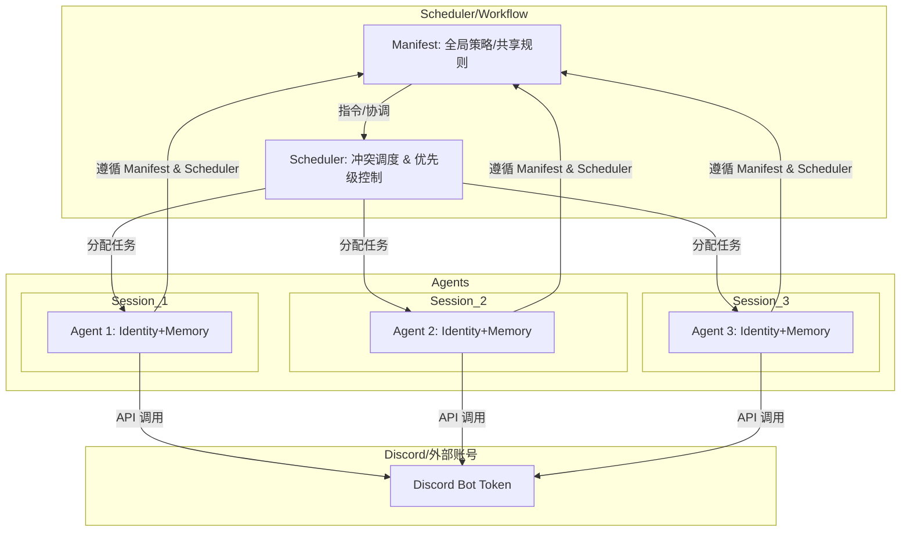

**用 mermaid 绘制 OpenClaw 的 多 session agent + Manifest + Scheduler 同步协作关系：**

```mermaid

flowchart TD
    subgraph Discord/外部账号
        A[Discord Bot Token]
    end

    subgraph Scheduler/Workflow
        M[Manifest: 全局策略/共享规则]
        S[Scheduler: 冲突调度 & 优先级控制]
    end

    subgraph Agents
        subgraph Session_1
            AG1[Agent 1: Identity+Memory]
        end
        subgraph Session_2
            AG2[Agent 2: Identity+Memory]
        end
        subgraph Session_3
            AG3[Agent 3: Identity+Memory]
        end
    end

    AG1 -->|遵循 Manifest & Scheduler| M
    AG2 -->|遵循 Manifest & Scheduler| M
    AG3 -->|遵循 Manifest & Scheduler| M

    M -->|指令/协调| S
    S -->|分配任务| AG1
    S -->|分配任务| AG2
    S -->|分配任务| AG3

    AG1 -->|API 调用| A
    AG2 -->|API 调用| A
    AG3 -->|API 调用| A
```
