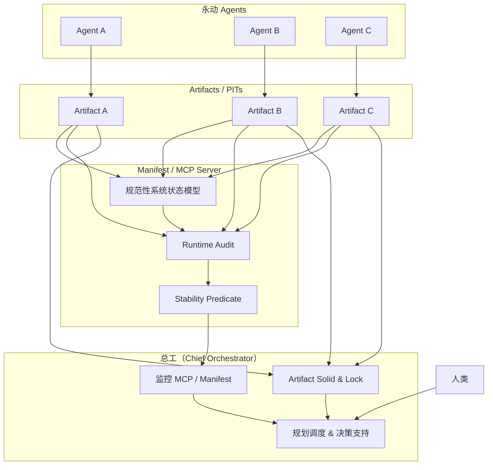

**落地openclaw的类架构图**   

图中关键逻辑说明

- Agents 永动执行任务：Agent A/B/C 持续运行，按自己的 workflow/skill 推进任务。

- Artifact 输出：Agent 的每次执行结果、PIT、分析产物都写入 Artifact 层。

- Manifest / MCP：将 Artifact 输出映射到 规范性系统状态模型，通过 runtime‑audit 和 stability predicate 评估是否稳定收敛。

- 总工（Chief Orchestrator）：

   监控 Manifest/MCP 状态

   对稳定的 Artifact 执行 Solid & Lock，保证数据不会被误改

   可视化整个系统状态，并提供人类决策支持

   人类：无需干预 agent 日常执行，只通过总工提供的可视化了解项目进展，可在必要时介入调整。

