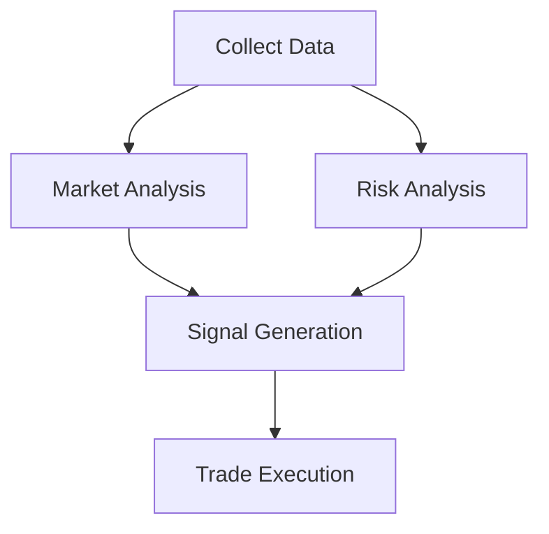

## 总工程师调度流程 (The Orchestrator Loop)
-----------------------------------
**所有并行或接替的 Agent 必须接入统一的 Nexus MCP 服务器。这不再是简单的文件传递，而是建立了一个持续的“项目工作场”**  

1. **分发阶段:** 总工读取 requirements.txt，调用逻辑能力最强的顶级llm-agent 生成任务清单。
   
2. **定义环境:** 配置 MCP 环境，挂载必要的本地/云端路径。

3. 创建物理空间，这个空间将映射到mcp server:/scope:agentname

  物理空间示例：

```tree
D:\ProjectNexus_Workspace\
├── nexus_manifest.json          # 全局唯一真相源 (SSOT)
├── requirements.txt             # 任务源头：总工定义的原始需求
│
├── 🛡️ scopes/                   # 物理隔离区 (Sandbox)
│   ├── DataMiner/               # Agent A 的私人领地
│   │   ├── temp/                # 临时计算空间
│   │   └── shadow_trace.log     # 该 Agent 的原始思考链（低权限）
│   ├── LogicFixer/              # Agent B 的私人领地
│   └── Auditor/                 # 审计者的空间
│
├── 📦 artifacts/                # 固化产物区 (The Truth)
│   ├── code/                    # 只有通过审计的代码才能进入这里
│   ├── data/                    # 经过清洗后的确定性数据
│   └── docs/                    # 会议纪要与决策日志 (Decision_Logs)
│
└── 📜 logs/                     # 审计足迹
    └── meeting_minutes/         # 历次冲突解决会议的 Markdown 记录
```    
4. **播种 (Seeding)：** 手动初始化第一个 `manifest.json`,menifest是全局唯一真相源 (SSOT)。

5. **驱动 (Activating)：** - 并行或者依次 启动 Agent A。
    
  *   Agent
      - 情况A: 读取 Manifest-scope加载任务 ➜ 思考 (Plan) ➜ 执行 (Act) ➜ 更新 Manifest-artifacts ➜ 退出.
      - 情况B: 若任务中断，下一个 Agent 被启用后将通过 MCP 直接继承“物理现场”。
        
6. **AgentB invoke或者active** 重复步骤5 ，进行接力

7. **总工** 发现
   - 调用audit-agent ，更新 Manifest-state
   - 如果next_agent` 状态变更为none，last_task 状态为 finish,通知碳基人类任务完成。
    
## Orchestrator 调度下的并行任务模型  
- 总工允许并行执行，任务结构通常是 DAG（有向无环图DAG）：



## 🛠️ 总工指令：如何部署这个白皮书？
-------------------

为了让你的 OPENCLAW  或任何AI agent 支持这套系统，需要为所有的 Agent 配置以下 **System Instruction** 的开头：

> “你已接入 **Project Nexus MCP 系统**。你的行为准则已在 `mcp://project/manifest.json` 中定义。
> 
> 1.  启动即读取 Manifest。
>     
> 2.  严禁修改已列入 `dead_ends` 的逻辑。
>     
> 3.  退出前必须总结当前状态并同步至 Manifest。
>     
> 4.  你的产出必须存放在 `mcp://artifacts/` 路径下。”
>
