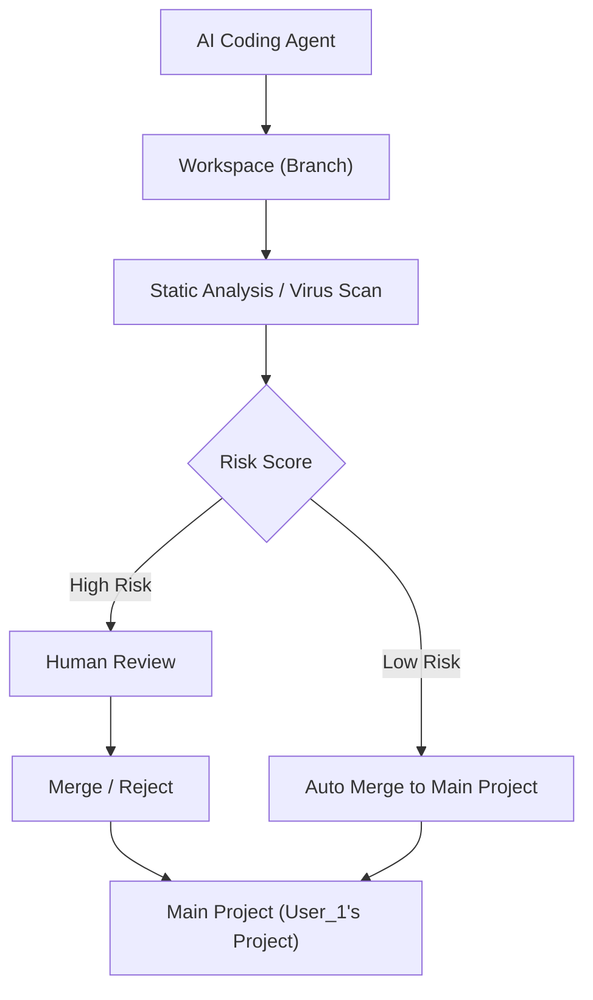

## AI Coding 安全架构图（完整 pipeline）

### 解释：

1.  **AI Coding Agent**：执行任务的 AI agent，生成修改代码的提案。
    
2.  **Workspace (Branch)**：AI agent 仅能在自己的工作区（如分支）中修改代码，不直接修改主项目目录。
    
3.  **Static Analysis / Virus Scan**：每次提交都会经过另一个LLM模型支持的security-agent 进行静态分析和病毒扫描，检测潜在的风险。
    
4.  **Risk Score**：security-agent根据分析结果生成风险评分。
    
5.  **Low Risk**：如果风险较低，apporval 代码自动合并到主项目中。
    
6.  **High Risk**：如果风险较高，进入碳基生物审查阶段，由碳基生物手动审核决定是否合并。
    
7.  **Main Project**：主项目目录，所有代码最终合并的地方。
    

这种模式能有效保护你的主项目免受恶意代码影响，并保持 AI agent 带来的高效性。

***

### 总结：

1.  **强烈建议**：AI agent 只在 **branch** 上工作，所有修改都通过 **pull request** 或 **merge request** 提交，并通过审查和分析过滤风险。
    
2.  **代码审查与自动化**：通过静态分析、病毒扫描、人工审核等多重防线确保代码的安全性。
    
3.  **最小化风险**：AI agent 和主项目代码分离，降低潜在恶意代码的影响，增强代码质量管理。
