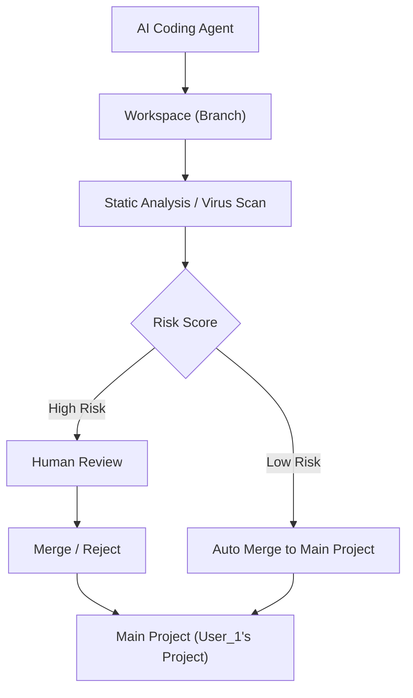

```mermaid
graph TD
    A[AI Coding Agent] --> B[Workspace #40;Branch#41;]
    B --> C[Static Analysis / Virus Scan]
    C --> D{Risk Score}
    D -->|Low Risk| E[Auto Merge to Main Project]
    D -->|High Risk| F[Human Review]
    F --> G[Merge / Reject]
    G --> H[Main Project #40;User_1's Project#41;]
    E --> H
```
