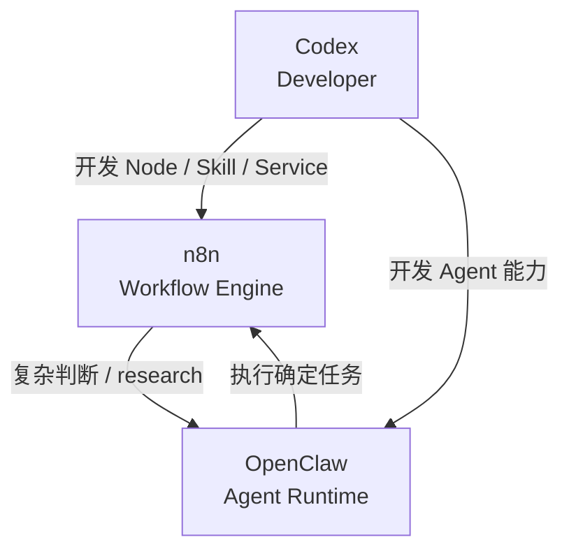

---

id: raw-fb35b334-17bf-4956-b6c7-46623cd515fb
title: "workflow到capital杠杆"
type: rawdata
primary_topic: "workflow到capital杠杆"
related_topics:
  - "Codex开发Lobster workflow"
  - "embedded Lobster的一个坑"
source_ref: "https://chatgpt.com/c/6a885efd-fce4-83ea-b682-382c7c7d6927"
captured_at: 2026-08-25
status: draft

---

例如你完全可以在 Codex project 中这样组织：

openclaw-system/

│

├── workflows/

│   ├── article-publish.lobster

│   ├── research.lobster

│   └── daily-scan.lobster

│

├── scripts/

│   ├── collect.py

│   ├── validate.py

│   └── publish.py

│

├── schemas/

│   └── article.schema.json

│

├── skills/

│   ├── essay-to-all-style/

│   └── to-google-drive/

│

└── tests/

然后让 Codex 改：

workflows/article-publish.lobster

OpenClaw 去运行：

lobster.run(...)

这比：

Codex session

   ↓

自己记住执行到哪

   ↓

一步一步调用

可靠得多。

这里还有一个非常重要的区别。

Lobster 的优势不是“它能调用 LLM”。

恰恰相反，它的核心优势是：

> **把不应该让 LLM 临场决定的东西，从 LLM 手里拿出来。**

例如：

❌ Agent 自由发挥

LLM:

“我现在应该先下载？

还是先分析？

还是上传？

算了我先生成文章……”

变成：

✅ Lobster

collect

  ↓

normalize

  ↓

analyze

  ↓

validate

  ↓

approval

  ↓

publish

LLM 只负责：

analyze()

write()

judge()

而不负责：

下一步到底是什么

失败以后跳哪里

是否重复执行

是否已经发布

这和你之前设计 OpenClaw Manager/Worker 系统的思路其实高度一致。

但有一个当前版本的坑值得特别注意。

OpenClaw 官方明确写了：**embedded Lobster 内调用 `openclaw.invoke` 再嵌套调用部分 OpenClaw tools，目前并不完全可靠**，尤其类似 `llm-task` 这种 nested call。官方目前建议 embedded 模式下，要么直接在 Lobster 外调用 `llm-task`，要么 Lobster 内主要运行普通 CLI/script。[GitHub+1](https://github.com/openclaw/openclaw/blob/main/docs/tools/lobster.md?utm_source=chatgpt.com)

所以我目前更建议你用：

Manager Agent

│

├── llm-task

│

├── Lobster

│     ├── python

│     ├── node

│     ├── git

│     ├── filesystem

│     └── deterministic CLI

│

└── Task Flow

      ├── Worker A

      ├── Worker B

      └── Worker C

而不是：

Lobster

  ↓

openclaw.invoke

  ↓

Agent

  ↓

openclaw.invoke

  ↓

Agent

后者现在容易把系统做得很脆。

所以，如果回到你真正关心的 **Codex + OpenClaw** 架构，我建议明确分工：

| 层 | 负责 |

| --- | --- |

| Codex | 开发 workflow / skill / script / test |

| Git | workflow 与代码的版本控制 |

| OpenClaw Manager | 决策、任务分配 |

| Task Flow | 长生命周期 orchestration |

| Lobster | 确定性多步骤 workflow |

| Worker Agent | 推理、研究、生成 |

| Cron | 定时触发 |

| Heartbeat | 状态检查、机会发现 |

你之前把很多东西都想塞进 Manager 的 `AGENTS.md / HEARTBEAT.md`，长期看会越来越难维护。

更成熟的方向其实是：

SOUL / AGENTS

      ↓

决定“为什么做 / 什么时候做”

      ↓

Task Flow

      ↓

决定“这个任务生命周期是什么”

      ↓

Lobster

      ↓

决定“具体步骤严格怎么执行”

      ↓

scripts / tools

这套分层我认为特别适合你现在这个长期运行 OpenClaw expert system。[GitHub+1](https://github.com/openclaw/openclaw/blob/main/docs/tools/lobster.md?utm_source=chatgpt.com)

换句话说：

**Codex 是 workflow 的 IDE + engineer；OpenClaw 是 workflow 的 operator；Lobster 是 workflow engine。**

这三者放在一起是很合理的。

