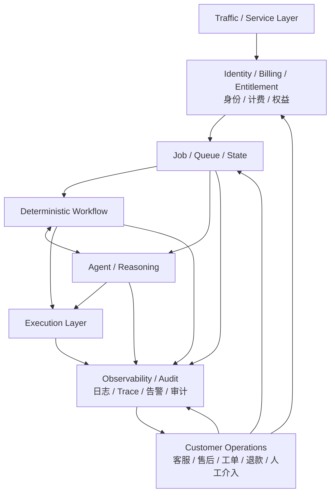

整的商业软件系统。真正闭合以后，至少要补上 **Customer Operations / Service Layer**，而且它不是简单挂在最外面的一条“客服线”，而是要能读取并干预 Job、Workflow、Agent、Execution 的状态。

更完整可以这样抽象：



这里客服系统的核心不是“聊天”，而是拥有**业务干预权**。比如客服要能：

```
查某个用户的 Job
→ 看失败在哪一步
→ 看 execution trace
→ 判断是否可重试
→ 补发 / 重跑
→ 修改状态
→ 退款 / 补额度
→ 转人工审核
```

所以它本质上是：

> **Human Control Plane**

而前面的 Job / Workflow / Agent / Execution 更像：

> **Machine Data Plane**

这两个面合起来才接近完整商业系统。

再进一步，商业软件常见的是三类闭环：

```
1. Delivery Loop
用户请求 → 执行 → 结果

2. Service Loop
异常 / 投诉 → 工单 → 干预 → 恢复 / 补偿

3. Learning Loop
日志 / 失败 / 用户反馈 → 分析 → 改规则 / Prompt / Workflow / 产品
```

因此一个真正成熟的平台，不只是：

而是：

这也解释了为什么很多早期自动化项目“能跑”，但还不能商业化：缺的往往不是主流程，而是**异常后的可解释、可恢复、可补偿、可追责**。

所以我们前面的通用抽象可以再更新成一句：

> **Traffic 管入口，Job 管规模，Workflow 管确定性，Agent 管不确定性，Execution 管现实动作，Observability 管可见性，Customer Operations 管人工治理，Identity/Billing 管商业关系。**

到这里，它才更接近一个完整的软件商业系统。
